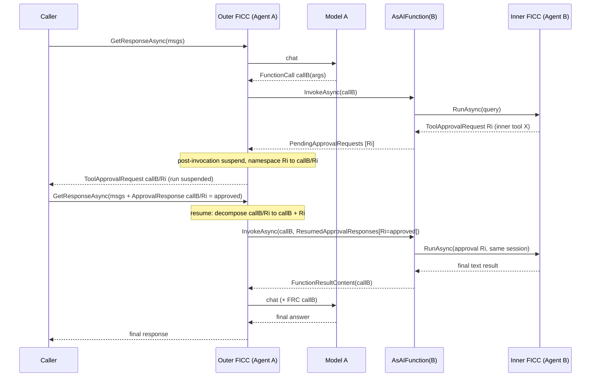
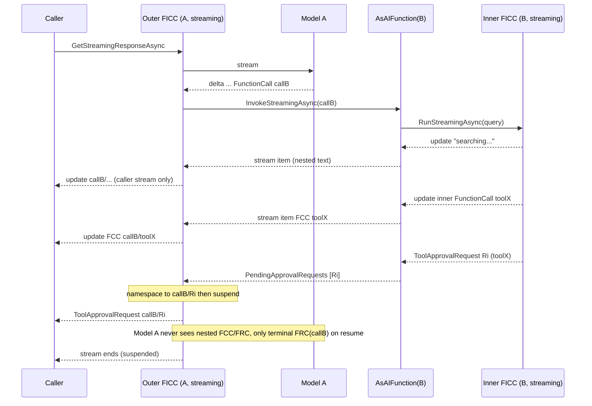
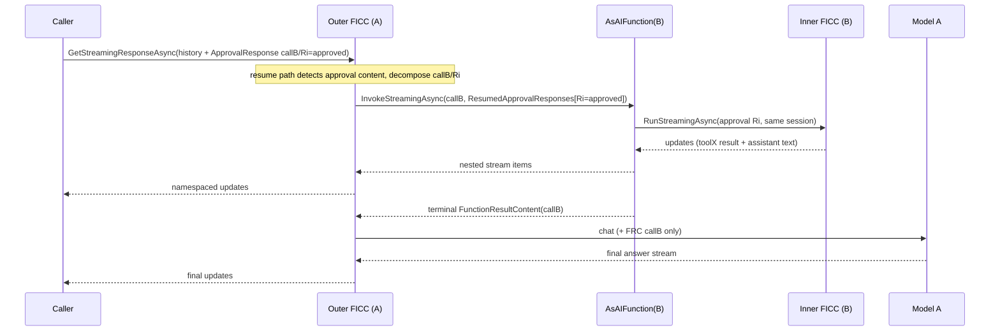
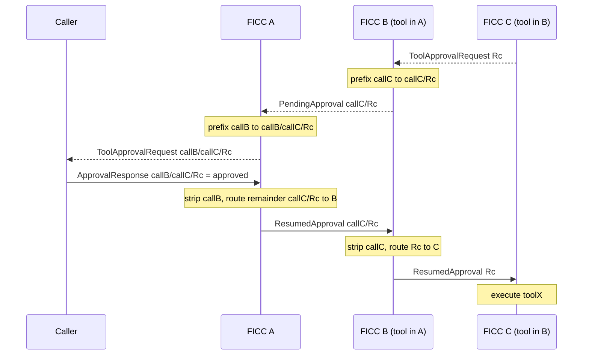

# Cascading Function Approval ("Function of Functions")

## Context and Problem Statement

When agents operate on behalf of a user, some actions require human approval before they run.
[ADR 0006](0006-userapproval.md) modelled this with `ToolApprovalRequestContent` /
`ToolApprovalResponseContent`: when a tool is wrapped in an `ApprovalRequiredAIFunction`, the
`FunctionInvokingChatClient` (FICC) suspends the run, returns an approval request to the caller,
and resumes once the caller sends back a matching response.

This works for **leaf** tools that the outermost FICC invokes directly. It breaks the moment a
tool's own execution *internally* needs approval. The canonical case is an **agent-as-tool**:
Agent B (which requires approval for some action) is registered as a tool inside triage Agent A
via `AsAIFunction()`. When A calls B, B's approval request never reaches the user — the run
silently bypasses human-in-the-loop.

- GitHub issue: <https://github.com/microsoft/agent-framework/issues/6062> — ".NET: [Bug]:
  Human-in-the-loop (AIApprovalFunction) not triggering when agent is used as a tool in a triage
  agent."
- Related upstream discussion: [dotnet/extensions#6492](https://github.com/dotnet/extensions/issues/6492).

The immediate cause is narrow: `AIAgentExtensions.AsAIFunction()` returns only `response.Text`
and discards every other content item — including `ToolApprovalRequestContent`
(`dotnet/src/Microsoft.Agents.AI/AgentExtensions.cs:72-90`).

The deeper cause is architectural. A FICC function produces exactly **one terminal**
`FunctionResultContent`; it has no way to say *"I am not finished — I need approval for an
internal action"* and have that request **cascade up** through one or more enclosing FICC loops
to the outermost caller, then have the caller's approval response route back **down** to the
function that raised it.

This ADR explores a **"function of functions"** abstraction: a function whose execution may
decompose into other functions/results, where any nested approval request can bubble up through
an **arbitrary** number of layers (A → B → C → …) and the corresponding response can be routed
back to the exact originating level. This is a **design exploration** — the deliverable is this
ADR, not production code.

### Scope

| Dimension | Decision |
| --- | --- |
| Deliverable | Design / ADR only. No production code in this effort. |
| Abstraction home | agent-framework design **plus** a proposal for upstream `Microsoft.Extensions.AI` FICC changes (dotnet/extensions). |
| Depth | Arbitrary nesting depth, not just one level. |
| Language | .NET only (the issue is `.NET`-tagged). |

## Current-state mechanics

These are the building blocks any design must work with (references against
`Microsoft.Extensions.AI` 10.6.0, the version this repo consumes).

1. **`AsAIFunction` flattens the response.** `InvokeAgentAsync` runs the inner agent and returns
   `response.Text`, dropping `ToolApprovalRequestContent` and any partial content.
   - `dotnet/src/Microsoft.Agents.AI/AgentExtensions.cs:72-90`.

2. **A FICC function result is terminal.** `InvokeFunctionAsync` returns `object?`; that becomes
   exactly one `FunctionResultContent` in a tool-role message. FICC *does* reuse a returned
   `FunctionResultContent` verbatim when its `CallId` matches — but a tool result message cannot
   suspend the loop or re-enter the function.
   - `FunctionInvokingChatClient.cs:1283-1290` (`InvokeFunctionAsync`), `1242-1276`
     (`CreateFunctionResultContent`), `1133-1180` (`ProcessFunctionCallsAsync`).

3. **FICC suspends only at the assistant-message level.** When a requested tool is an
   `ApprovalRequiredAIFunction`, FICC replaces its `FunctionCallContent` with
   `ToolApprovalRequestContent` (id composed from the call id) and stops. On the next request it
   consumes `ToolApprovalResponseContent`, recreates the `FunctionCallContent`, and continues.
   - `FunctionInvokingChatClient.cs:1624-1744` (replacement + `ComposeApprovalRequestId`),
     `854-860` (detecting approval content), `1352-1502` (`ProcessFunctionApprovalResponses`).
   - `ApprovalRequiredAIFunction` is only a marker `DelegatingAIFunction`
     (`Functions/ApprovalRequiredAIFunction.cs`); it does not enforce approval — the invoker does.

4. **AF already has a decorator + state-bag continuation pattern.**
   `NonApprovalRequiredFunctionBypassingChatClient` intercepts approval content on the way out,
   stores it in the session `AgentSessionStateBag`, and re-injects pre-approved responses on the
   next request — demonstrating exactly the intercept / persist / re-inject technique a cascading
   solution needs.
   - `dotnet/src/Microsoft.Agents.AI/ChatClient/NonApprovalRequiredFunctionBypassingChatClient.cs`.

5. **Workflows already bubble nested approvals correctly.** `HandoffAgentExecutor` surfaces
   nested approvals using `AIContentExternalHandler<ToolApprovalRequestContent,
   ToolApprovalResponseContent>` and routes responses with `MarkRequestAsHandled(RequestId)`.
   This is the reference "bubble up + route back" channel that the FICC world lacks.
   - `dotnet/src/Microsoft.Agents.AI.Workflows/Specialized/HandoffAgentExecutor.cs:149-231`.

6. **Parent → child run context already flows.** [ADR 0015](0015-agent-run-context.md) gives a
   child agent access to the parent session/options via `AIAgent.CurrentRunContext`, and
   `AsAIFunction` already uses `FunctionInvokingChatClient.CurrentContext` to forward
   `AdditionalProperties`.
   - `docs/decisions/0015-agent-run-context.md:29-70`; `AgentExtensions.cs:76-79`.

7. **The community-stated contract.** Issue comment (rpelevin): the approval envelope must
   *survive* agent-as-tool wrapping and preserve parent agent/run id, child agent/run id, nested
   tool call id, approval function name, target operation, an arguments digest, approval state
   (pending / approved / denied / timeout), the final resolver, and fail-closed/timeout
   behaviour — and bare `"approve"` text without a matching decision id must **not** execute the
   child action.

## The "function of functions" model

We model a function invocation not as an atomic `args → result` call, but as a node that may
**decompose** into sub-invocations (sub-functions, or an inner agent's own tool loop), each of
which can itself decompose. Approval flows along the edges of that tree:

- **Leaf approval** — raised by the outermost FICC for a directly-invoked
  `ApprovalRequiredAIFunction`. Already supported today.
- **Nested approval** — raised *inside* a function's execution (e.g. the inner agent's FICC).
  Must **cascade up** to the caller as a first-class approval request.
- **Cascade** — a nested approval traverses N enclosing FICC layers up to the outermost caller;
  the matching response traverses the same N layers back down to the originating node.

Two properties make cascading (as opposed to one-level) actually work, and both are central to
this design:

- **Reversible request-ID namespacing.** As an approval request crosses a function boundary with
  outer call id `Co`, its id is prefixed to form a path (`Co » innerId`). Crossing another layer
  `Co2` yields `Co2 » Co » innerId`. A response strips one segment per layer and forwards the
  remainder, so it unwinds to the exact originating node in O(1) per layer. The path must be
  reversible and use a separator that cannot collide with provider call-ids (call-ids are
  typically opaque alphanumerics; the encoding must escape or reserve the separator).
- **Suspend / resume continuation.** A node that raised an approval is *suspended*, not failed.
  Its continuation state (the inner agent's session/thread holding the pending request) must be
  preserved so that, on resume, the **same** node re-enters with the response and continues —
  potentially raising further approvals, which cascade again.

## Design sub-problems

Any complete solution must answer all five:

1. **Result model.** How does a function express "pending approval" instead of a terminal
   result? A `FunctionResultContent` is terminal today.
2. **Outer-loop suspend / resume + routing.** How does the outer FICC learn that a *function
   result* yielded nested approvals (so it suspends), and on resume route the incoming response
   back **into** that function instead of treating it as approval for the outer tool call?
3. **ID correlation across depth.** The reversible path-namespacing above, applied consistently
   at every layer.
4. **Continuation / session state.** The nested agent holds pending state in its session; resume
   must re-invoke the **same** inner session. A stateless `AsAIFunction` (new session per call)
   breaks this.
5. **The `AsAIFunction` bridge.** Mapping inner `response.Messages` (approval requests + partial
   text) into the cascading channel, and feeding the response back into the inner `RunAsync` on
   resume.

## Decision Drivers

- **Encapsulation (ADR 0006).** An agent must keep its internal logic private yet still surface
  approvals — the caller approves *an action*, not the agent's whole tool graph.
- **Arbitrary depth.** The mechanism must compose to N levels without special-casing depth 1.
- **Fail-closed.** A nested approval that cannot be surfaced must **block** the action, never
  silently auto-execute (the current bug fails *open*).
- **Routing correctness.** A response must execute *only* the action it was issued for; an
  unmatched / bare approval must not execute anything (rpelevin's second acceptance test).
- **Reuse existing primitives.** Prefer the established content types, `CurrentRunContext`,
  state-bag continuation, and the workflow `AIContentExternalHandler` channel over net-new
  concepts.
- **Upstream alignment.** The clean primitive likely belongs in MEAI FICC; the AF design should
  both interoperate with that future primitive and stand alone until it lands.

## Considered Options

- **Option A — Status quo (leaf-only approvals).** Baseline; equals the bug.
- **Option B — agent-framework-only decorator + smarter `AsAIFunction`.** Intercept inner
  approvals in AF, namespace their ids, persist the inner session, surface them to the outer
  caller, and reconstruct the inner response on resume. No upstream changes.
- **Option C — upstream MEAI FICC "re-enterable function result" primitive.** Let a function emit
  *non-terminal* pending-approval content that suspends the FICC loop and re-enters the function
  on resume, with built-in ID composition.
- **Option D — unified external-content-handler / recursive FICC.** Generalise the workflow
  `AIContentExternalHandler` channel into a single cascading mechanism shared by FICC and agents.

## Decision Outcome

Proposed (to be ratified by deciders): a **hybrid**.

- **Long-term foundation: Option C, informed by Option D.** The correct home for a true
  "function of functions" primitive is the FICC itself — a function must be able to return
  non-terminal pending-approval content and be re-entered with the response. Option D's unified
  external-content channel is the conceptual generalisation; Option C is its concrete FICC-level
  expression and the one we propose upstream. This delivers arbitrary-depth cascading with
  deterministic routing and no per-layer bespoke code.
- **Interim, ships first: Option B.** Until the upstream primitive exists, a self-contained
  agent-framework decorator + `AsAIFunction` change fixes #6062 and supports arbitrary depth by
  carrying the cascade through the existing leaf-approval mechanism and the session state bag.
  Option B is designed to become a thin adapter once Option C lands, not a throwaway.

Option A is rejected (it *is* the bug). Option D is adopted as the **framing** for C rather than
a separate deliverable, to avoid forking the workflow and FICC approval channels.

### Consequences

- Good — nested approvals survive agent-as-tool wrapping; human-in-the-loop is **fail-closed**.
- Good — arbitrary depth falls out of reversible ID namespacing + per-layer continuation; no
  depth special-casing.
- Good — Option B unblocks users now without waiting on a dotnet/extensions release; Option C
  gives a principled long-term primitive.
- Neutral — two coexisting mechanisms (AF decorator now, FICC primitive later) until the upstream
  change ships; the ADR commits to collapsing B into an adapter over C.
- Bad — ID path-namespacing needs a collision-safe, reversible encoding over opaque provider
  call-ids; gets it wrong and responses misroute.
- Bad — continuation requires persisting inner agent sessions across suspend/resume, enlarging
  serialized thread state and coupling to session-serialization guarantees
  ([ADR 0018](0018-agentthread-serialization.md)).

### Validation

Two acceptance scenarios drawn directly from the issue:

1. **Parity.** Calling Agent B directly triggers its `ApprovalRequiredAIFunction`. Registering B
   as a tool in Agent A and invoking B through A surfaces the **same** pending approval envelope
   to the outermost caller *before* the action executes. Extend to A → B → C to prove depth.
2. **Routing / fail-closed.** A `ToolApprovalResponseContent` executes *only* the action it
   targets; bare `"approve"` text (no matching decision id) executes **nothing**, and an
   unresolved nested approval blocks rather than auto-runs.

## Pros and Cons of the Options

### Option A — Status quo (leaf-only approvals)

- Good — no work; existing leaf approvals keep working.
- Bad — *is* the reported bug; fails open (silently bypasses approval).
- Bad — no path to arbitrary depth.

### Option B — agent-framework-only decorator + smarter `AsAIFunction`

Shape:

- `AsAIFunction` stops returning `response.Text` unconditionally. On invocation it runs the inner
  agent, then inspects `response.Messages`:
  - **No external-input content** → return `response.Text` (today's behaviour).
  - **Contains `ToolApprovalRequestContent`** → namespace each request id with the outer call id
    and surface them as the cascading payload; persist the inner session keyed by the namespaced
    call id in the outer session's `AgentSessionStateBag` (the
    `NonApprovalRequiredFunctionBypassingChatClient` pattern).
- A delegating chat client sitting above the outer FICC (sibling to
  `NonApprovalRequiredFunctionBypassingChatClient`) lifts those namespaced nested requests into
  the outer assistant message — reusing the **leaf** approval surface so the outer FICC suspends
  with no FICC changes — and on the next request strips the prefix from each
  `ToolApprovalResponseContent` and routes it back to the persisted inner session, calling the
  inner `RunAsync` again (which may cascade further).
- Arbitrary depth works because each layer applies the same prefix-on-the-way-up /
  strip-on-the-way-down rule.

- Good — fixes #6062 with no dependency on a dotnet/extensions release.
- Good — reuses proven AF primitives (state bag, `CurrentRunContext`, leaf approval surface).
- Good — composes to arbitrary depth via consistent per-layer namespacing.
- Neutral — surfaces nested requests through the *leaf* approval surface, so the outer model sees
  an approval "for the agent tool call" that actually represents an inner action; the envelope
  metadata must make the true target explicit.
- Bad — fights the grain of FICC (a function is still "terminal"); the decorator must carefully
  reconcile the outer tool call's own result with the suspended state.
- Bad — persisting inner sessions in the outer state bag couples to session serialization and
  grows thread state.

### Option C — upstream MEAI FICC "re-enterable function result" primitive

Shape (proposed `Microsoft.Extensions.AI` surface — illustrative, not final):

- Allow a function's effective result to carry **non-terminal** pending-approval content that
  FICC recognises and does **not** turn into a terminal `FunctionResultContent`. Two candidate
  expressions:
  - *Return-based:* the function returns content including `ToolApprovalRequestContent`; FICC
    detects pending approvals and, instead of emitting a tool result, splices them into the
    assistant message (same place leaf approvals surface) and suspends.
  - *Context-based:* `FunctionInvocationContext` exposes a `PendingApprovalRequests` collection
    plus a `RequiresResume` flag the function sets; FICC reads them after invocation. A paired
    inbound `FunctionInvocationContext.ApprovalResponses` carries responses on re-entry.
- FICC owns **ID composition**: it already has `ComposeApprovalRequestId`; extend it to compose a
  reversible path as requests cross the function boundary, and to decompose on resume so a
  response whose id maps to a *function* (not a direct tool) **re-enters that function** rather
  than executing a tool.
- The function (e.g. the `AsAIFunction` wrapper) owns its own continuation keyed by call id.

- Good — the clean, correct primitive; "function of functions" becomes first-class.
- Good — deterministic routing and depth handled centrally by FICC; no per-layer adapters.
- Good — benefits the whole MEAI ecosystem, not just agent-framework (cf. dotnet/extensions#6492).
- Neutral — must define re-entry semantics (idempotency, partial results, error/timeout) precisely.
- Bad — requires a dotnet/extensions change and release; cannot ship immediately.
- Bad — broadens the FICC contract (functions can now be suspended/re-entered), a non-trivial
  semantic addition to a widely-used type.

### Option D — unified external-content-handler / recursive FICC

Shape: generalise the workflow `AIContentExternalHandler<TRequest, TResponse>` channel
(`HandoffAgentExecutor.cs:149-231`) into a single abstraction that both FICC and agents raise
approvals through, so an agent-as-tool and a workflow executor cascade identically.

- Good — one mental model and one code path for *all* external-input cascading (approvals,
  elicitation, function-call hand-offs).
- Good — naturally arbitrary-depth and already proven in the workflow engine.
- Neutral — best realised *as* the design behind Option C rather than a separate user-facing API.
- Bad — largest surface area / refactor; risks coupling FICC to workflow concepts.
- Bad — highest cost to land standalone; overkill if only approvals are in scope today.

## Option C — Deep Dive (full-streaming, upstream-ready)

This section sizes Option C under the **strongest** interpretation of "inner function
invocations should be visible to the outside invoker": **full streaming pass-through** — the
outer FICC caller sees the inner agent's *live* streamed activity (text, nested tool calls,
nested approvals), not merely the final result. This is materially larger than approvals-only
cascading and is best understood as making **FICC function invocations streaming-capable**.

Headline: this is an **L/XL** feature spanning both `Microsoft.Extensions.AI.Abstractions` and
`Microsoft.Extensions.AI`, requiring formal API review and careful history/round-trip handling.
We therefore recommend **phasing** (see C.8).

### C.1 What full-streaming pass-through requires

1. **Streaming-capable function invocation.** A function must be able to emit an ordered stream
   of `ChatResponseUpdate`s *during* its execution, plus a terminal result — not just a single
   `object?`.
2. **Nested-content visibility with path-namespaced IDs.** Inner `FunctionCallContent`,
   `FunctionResultContent`, `ToolApprovalRequestContent`, and message IDs must be surfaced to the
   *outer caller stream* under a reversible per-layer path prefix so they neither collide with
   outer IDs nor get mis-attributed.
3. **Post-invocation suspend.** When an inner stream yields a pending approval, the outer loop
   must suspend — a trigger that today exists only **pre-invocation**.
4. **Streaming resume / re-entry.** On resume, the outer FICC must re-enter the suspended
   streaming invocation, which continues the inner agent from its pending state.
5. **Arbitrary depth.** All of the above must compose A → B → C → … by re-applying the prefix per
   layer.

### C.2 Current-state constraints (grounded in `Microsoft.Extensions.AI` 10.6.0)

- **Invocation is opaque & single-result.** `AIFunction` exposes only `InvokeAsync` /
  `InvokeCoreAsync` → `ValueTask<object?>`
  (`Abstractions/Functions/AIFunction.cs`). The shared `FunctionInvocationProcessor`
  (`Common/FunctionInvocationProcessor.cs`, `internal sealed`, also used by
  `FunctionInvokingRealtimeClientSession`) invokes through a
  `Func<FunctionInvocationContext, CancellationToken, ValueTask<object?>>` and returns one
  `FunctionInvocationResult` per call. There is **no** streaming-invoke surface anywhere.
- **Result is terminal.** `CreateResponseMessages` (`FunctionInvokingChatClient.cs:1231-1290`)
  turns each result into exactly one tool-role `FunctionResultContent`.
- **Suspend is pre-invocation, both paths.** Non-streaming
  `ReplaceFunctionCallsWithApprovalRequests` (`:358`) runs before `ProcessFunctionCallsAsync`
  (`:408`); streaming `CheckForApprovalRequiringFCC` + `TryReplaceFunctionCallsWithApprovalRequests`
  (`:605-628`) run before invocation. `FunctionInvocationContext` has `Terminate` but **no**
  pending-approval / resumed-response / streaming-emit channel (`FunctionInvocationContext.cs`).
- **Streaming yield bookkeeping is intricate** — buffered `updates`, `lastYieldedUpdateIndex`,
  in-place FCC→approval replacement (`:534-694`).
- **Resume lives at the top of both methods** — `ProcessFunctionApprovalResponses` (`:1298+`) +
  `InvokeApprovedFunctionApprovalResponsesAsync` (`:1710`), keyed off `HasAnyApprovalContent`.

### C.3 Proposed design

**(a) Streaming invocation contract — recommended: a virtual streaming method on `AIFunction`.**
Add an *optional, non-breaking* streaming entry point whose default implementation wraps the
existing single-result path, so existing `AIFunction` implementers are unaffected and only
stream-aware functions (the agent-as-tool wrapper) override it.

```csharp
// Microsoft.Extensions.AI.Abstractions/Functions/AIFunction.cs  (ADDITIVE, illustrative)
public abstract class AIFunction : AIFunctionDeclaration
{
    // Existing: ValueTask<object?> InvokeAsync(...) / protected abstract InvokeCoreAsync(...)

    /// <summary>Streams interim activity and a terminal result. Default wraps InvokeCoreAsync.</summary>
    public IAsyncEnumerable<FunctionInvocationStreamItem> InvokeStreamingAsync(
        AIFunctionArguments arguments, CancellationToken ct = default)
        => InvokeStreamingCoreAsync(arguments, ct);

    protected virtual async IAsyncEnumerable<FunctionInvocationStreamItem> InvokeStreamingCoreAsync(
        AIFunctionArguments arguments, [EnumeratorCancellation] CancellationToken ct = default)
    {
        var result = await InvokeCoreAsync(arguments, ct).ConfigureAwait(false);
        yield return FunctionInvocationStreamItem.ForResult(result); // single terminal item
    }
}

// A stream item is EITHER passthrough activity OR a pending-approval suspend OR the terminal result.
public sealed class FunctionInvocationStreamItem
{
    public ChatResponseUpdate? Update { get; init; }                 // nested activity to surface
    public IReadOnlyList<ToolApprovalRequestContent>? PendingApprovals { get; init; } // suspend
    public object? Result { get; init; }                            // terminal result
    public bool IsTerminal { get; init; }
}
```

*Alternatives considered:* a FICC-level `FunctionStreamingInvoker` delegate (parallels the
existing `FunctionInvoker`) — keeps abstractions untouched but cannot express the agent-as-tool
case cleanly; and a `FunctionInvocationContext.StreamWriter` emit-channel — avoids signature
changes but adds concurrency/ordering plumbing. The virtual method is the most discoverable and
the least surprising.

**(b) Path ID namespacing.** Replace the flat `ComposeApprovalRequestId(callId)` (`:1704`,
`ficc_{callId}`) with a reversible path codec applied as content crosses each function boundary:

```csharp
internal static string ComposeRequestPath(string outerCallId, string innerId);   // outerCallId + sep + innerId
internal static bool TryDecomposeRequestPath(string path, out string outerCallId, out string innerId);
```

The separator must be escaped against opaque provider call-IDs (open question #2). The same codec
namespaces nested `FunctionCallContent.CallId` / `FunctionResultContent.CallId` / message IDs that
are surfaced to the caller stream.

**(c) Post-invocation suspend trigger (both paths).** After invocation, if any invoked function
yielded `PendingApprovals`, FICC treats it like a leaf approval: it surfaces the namespaced
`ToolApprovalRequestContent`(s) and **suspends** (breaks the loop / ends the stream) instead of
emitting the terminal `FunctionResultContent` and continuing.

**(d) Streaming resume / continuation.** Resume is a fresh outer call carrying the
`ToolApprovalResponseContent`. The top-of-method resume path decomposes the path, identifies the
owning function-call, and **re-invokes that streaming function** with the de-namespaced response
delivered via `FunctionInvocationContext.ResumedApprovalResponses`. The function (agent-as-tool
wrapper) owns its inner continuation (the inner agent **session**); FICC does not persist it.
Re-entry may suspend again → cascade continues.

> **Crucial scoping clarification.** "Visible to the outer invoker" means visible on the outer
> **response stream** (application/observability), **not** injected into the outer **model's**
> context. The outer provider request still only ever receives the single terminal
> `FunctionResultContent` for the outer call. This separation is what keeps provider round-trip
> tractable (see C.6).

### C.4 Proposed public API surface (upstream-ready, illustrative)

| Package | Type | Addition | Compat |
| --- | --- | --- | --- |
| Abstractions | `AIFunction` | `InvokeStreamingAsync` + virtual `InvokeStreamingCoreAsync` (default wraps `InvokeCoreAsync`) | Additive, non-breaking |
| Abstractions | `FunctionInvocationStreamItem` (new) | passthrough update / pending-approvals / terminal result | New type |
| AI | `FunctionInvocationContext` | `PendingApprovalRequests` (out), `ResumedApprovalResponses` (in) | Additive |
| AI | `FunctionInvokingChatClient` | optional `FunctionStreamingInvoker`; recognizes streaming-capable functions | Additive |
| AI | id codec | `ComposeRequestPath` / `TryDecomposeRequestPath` (internal) | Internal |

All additive and **default-off**: a function that doesn't override streaming or set
`PendingApprovalRequests` behaves exactly as today.

### C.5 Per-file / per-method change list + sizing

| File / method | Change | Size |
| --- | --- | --- |
| `Abstractions/Functions/AIFunction.cs` | add streaming invoke (virtual + default) | M |
| `Abstractions/.../FunctionInvocationStreamItem.cs` (new) | stream-item type | S |
| `ChatCompletion/FunctionInvocationContext.cs` | `PendingApprovalRequests`, `ResumedApprovalResponses` | S |
| `Common/FunctionInvocationProcessor.cs` | streaming variant; per-call attribution; honor suspend; concurrency policy | **L** |
| FICC `GetResponseAsync` loop (`:340-418`) | post-invocation suspend; aggregate nested messages | M |
| FICC `GetStreamingResponseAsync` loop (`:534-694`) | consume + namespace + yield nested stream; post-invocation suspend; break | **L** |
| FICC `CreateResponseMessages` (`:1231-1290`) | emit namespaced `ToolApprovalRequestContent` for suspended invocations | M |
| FICC id codec (`ComposeApprovalRequestId` `:1704` + new decompose) | path encode/decode w/ escaping | S |
| FICC resume (`ProcessFunctionApprovalResponses` `:1298`, `InvokeApprovedFunctionApprovalResponsesAsync` `:1710`) | detect composite IDs → re-enter streaming function w/ `ResumedApprovalResponses`; may re-suspend | **L** |
| FICC history helpers (`FixupHistories`, `MarkServerHandledFunctionCalls`, `ConvertToolResultMessageToUpdate`) | account for nested/namespaced content | M |
| `FunctionInvokingRealtimeClientSession` (shares the Processor) | ensure streaming-invoke changes are opt-in / no realtime regression | M |
| Tests (`Abstractions.Tests`, `AI.Tests`) | both paths × {depth>1, parallel, rejection, streaming chunking, resume, timeout} | **L** |

Net: **L/XL**, with the streaming loop, the processor, and the streaming-resume path as the three
heaviest items.

### C.6 Streaming vs non-streaming feasibility

- **Non-streaming: moderate.** The loop already breaks-and-returns cleanly; the post-invocation
  suspend mirrors the existing pre-invocation one. Nested activity is aggregated into
  `response.Messages` as namespaced content. Main care: retaining completed sibling results.
- **Streaming: hard.** Interleaving a *nested live stream* into the buffered-yield machinery,
  attributing each update to its call path, and surfacing a mid-stream suspend cleanly is the
  crux. The existing `lastYieldedUpdateIndex` bookkeeping must coexist with nested updates.
- **Interleaving / concurrency** (`AllowConcurrentInvocation = true`): updates from concurrent
  inner streams must carry call-path attribution; recommend a defined merge (e.g. await-all then
  surface, or a serialized suspension boundary) rather than racy interleave.
- **History / provider round-trip:** because nested content is surfaced to the *caller stream*
  only and **not** sent to the outer provider (C.3 clarification), the outer model still sees just
  the terminal FRC — this sidesteps the worst round-trip hazard. The application, however, now
  receives a richer stream it must be able to ignore or render.
- **Mid-stream suspend/resume:** resume is **not** a paused `IAsyncEnumerator`; it is a fresh
  outer streaming call whose resume path re-enters the suspended function, which re-streams from
  the inner agent's persisted session. Inner continuity is reconstructed, not held open.
- **Parallel-batch suspension policy:** mirror leaf "all-or-nothing" — collect pending approvals
  from all invoked functions, surface together, suspend; on resume re-enter each suspended
  function with its own responses.

### C.7 Sequence diagrams

**1 — Non-streaming cascade with nested approval (suspend + resume).**



**2 — Streaming pass-through with nested tool call + nested approval (mid-stream suspend).**



**3 — Streaming resume / re-entry.**



**4 — Arbitrary-depth A → B → C namespacing.**



### C.8 Phasing, risks, and process notes

**Recommended phasing.**

- **Phase 1 — approvals-only cascade (smaller, additive).** Add `PendingApprovalRequests` /
  `ResumedApprovalResponses` + path-namespacing + post-invocation suspend, *without* the streaming
  pass-through of nested non-approval activity. Fixes #6062 at arbitrary depth.
- **Phase 2 — full streaming pass-through (L/XL).** Add the streaming invoke surface and the
  nested live-update interleaving. Larger surface, larger test matrix, realtime-parity review.

**Risk register.**

- *Streaming interleave correctness* (ordering/attribution across concurrent inner streams) — high.
- *Mid-stream suspend/resume* reconstruction fidelity — high.
- *ID path encoding* collisions/escaping over opaque call-IDs — medium.
- *Realtime session parity* via the shared `FunctionInvocationProcessor` — medium.
- *Caller-stream vs model-context separation* misuse (accidentally feeding nested content to the
  outer model) — medium; must be enforced by design + tests.
- *Serialization* of inner continuation/session across resume (ADR 0018) — medium.

**Process notes.** Net-new public API on `AIFunction` and `FunctionInvocationContext` requires
dotnet/extensions **API review**; ships in a future `Microsoft.Extensions.AI` release; agent-
framework must then bump its MEAI dependency from 10.6.0. Track upstream against
[dotnet/extensions#6492](https://github.com/dotnet/extensions/issues/6492).

## More Information

- Builds on: [ADR 0006 — Agent User Approvals](0006-userapproval.md),
  [ADR 0015 — AgentRunContext](0015-agent-run-context.md),
  [ADR 0018 — AgentThread serialization](0018-agentthread-serialization.md).
- Reference implementation of bubble-up + routing in workflows:
  `dotnet/src/Microsoft.Agents.AI.Workflows/Specialized/HandoffAgentExecutor.cs`.
- Existing AF intercept/persist/re-inject pattern:
  `dotnet/src/Microsoft.Agents.AI/ChatClient/NonApprovalRequiredFunctionBypassingChatClient.cs`.
- Upstream FICC mechanics referenced above:
  `Microsoft.Extensions.AI` 10.6.0 `FunctionInvokingChatClient.cs`
  (`InvokeFunctionAsync`, `CreateResponseMessages`, `ComposeApprovalRequestId`,
  `ProcessFunctionApprovalResponses`).
- Open questions for the deciders:
  1. Confirm Option C is pursued upstream (owner + dotnet/extensions issue) vs. AF-only long-term.
  2. The reversible ID-path encoding/escaping over opaque provider call-ids.
  3. Re-entry semantics on resume: idempotency, partial inner results, denial, and timeout.
  4. Whether non-approval external inputs (e.g. MCP elicitation) ride the same channel now.
  5. Session-continuation persistence vs. thread-serialization guarantees (ADR 0018).
